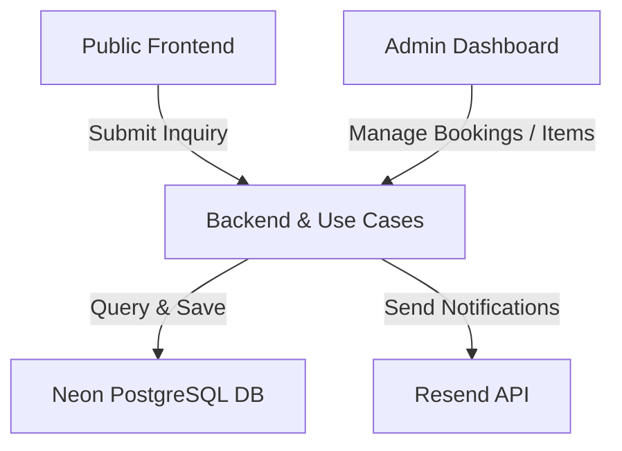

# System Architecture

This document defines the permanent structural layout, responsibilities of each sub-system, and data ownership boundaries.

---

## 1. Architectural Core Layers

### A. Public Frontend
- **Responsibilities**: Renders public pages, displays category structures and product lists, displays product detail parameters, and operates the local inquiry cart and booking forms.
- **Constraints**: Renders content dynamically based on API responses. It does **not** hold the final validation rules for availability, status changes, or price calculations.

### B. Backend & Use-Cases (Core Business Logic)
- **Responsibilities**: Isolated domain and application service layers (`src/lib/booking-core`).
- **Core Operations**:
  - Serves catalog data, categories, and item media files.
  - Controls booking request persistence and transition commands.
  - Resolves inventory stock, verifies overlaps, and applies pricing multipliers.
  - Sends transactional emails.
- **Wiring**: Handlers are injected into serverless route APIs (`src/app/api`) or imported into Next.js Server Components.

### C. Admin Dashboard
- **Responsibilities**: Web console for the operator.
- **Functions**: Managing booking records, adding internal log notes, adjusting calendar blocker intervals, and performing CRUD actions on items, categories, media assets, FAQs, and global site settings.

---

## 2. Data Ownership: The Database as the Source of Truth

- **Single Source of Truth**: The PostgreSQL database (Neon) is the absolute authority on system state. 
- **Validation Boundary**: The frontend only reports user selections. The backend re-validates all parameters (dates, item IDs, quantities, final totals) against current database records prior to saving. No client-calculated value overrides backend validation.

---

## 3. Deployment & Cloud Services
- **Hosting Platform**: **Vercel** hosts the Next.js application, running pages and API routes as serverless and edge functions.
- **Database Engine**: **Neon DB** stores relational tables and queries via the Prisma ORM client.
- **Transactional Mailer**: **Resend** delivers confirmation, notification, and direct-action emails to customers and administrators.
