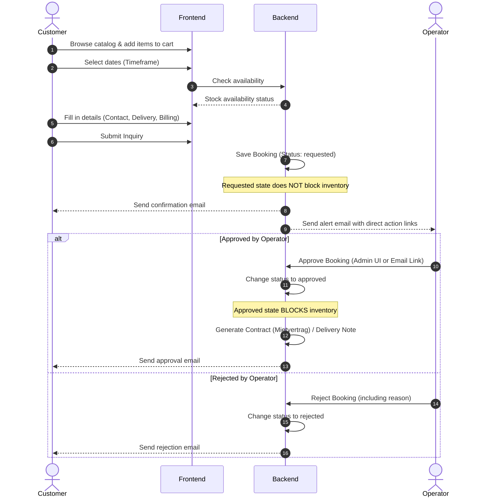

# Booking Inquiry Lifecycle Flow

This document describes the step-by-step process of a customer booking inquiry, from initial browsing to final administrative processing and contract generation.

---

## The Target Process Flow

---

## Detailed Sequence Steps

### Step 1: Catalog Discovery & Cart Additions
- The customer browses the catalog types and categories, viewing product specifications.
- The customer adds one or more items to the inquiry cart.

### Step 2: Timeframe Selection & Availability Checks
- The customer specifies a rental start and end date in the date picker.
- The system runs a background availability check to verify that the items in the cart are in stock for the selected timeframe. If items are out of stock or clashing with manual blockers, warning banners are shown.

### Step 3: Checkout Details Submission
- The customer inputs contact details (first name, last name, email, phone).
- The customer enters a delivery/event address.
- The customer can optionally enter a different billing address (otherwise defaults to matching the delivery address).
- Customer submits the inquiry.

### Step 4: Save Inquiry (Status: `requested`)
- The backend recalculates prices, validates dates, checks stock, and commits the booking with status `requested` to the database.
- **Inventory State**: In the `requested` state, the items are **not** reserved. The dates remain open for other customers to request.

### Step 5: Email Dispatches
- **Customer Confirmation**: The customer receives an email confirming receipt of the request.
- **Admin Notification**: The operator receives an alert email containing full details, customer remarks, and cryptographically signed direct-action links (Approve/Reject).

### Step 6: Administrative Review
- **Option A: Approve (`approved`)**
  - **Stock Lock**: The timeframe is immediately blocked. Other customers checking out overlapping dates will be flagged as unavailable.
  - **Documents**: A rental contract (Mietvertrag) and delivery note (Lieferschein) are automatically generated and linked.
  - **Notification**: The customer receives an approval email.
- **Option B: Reject (`rejected`)**
  - **No Lock**: No inventory is locked.
  - **Notification**: The customer receives an email with the rejection explanation.
- **Option C: Cancel (`cancelled`)**
  - If an approved booking is cancelled, the status changes to `cancelled`, and the stock lock is immediately released.
