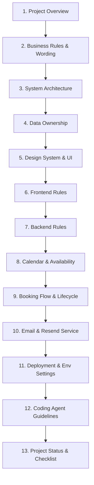

# Developer & Agent Context Documentation

This directory contains comprehensive system guidelines, architectural rules, and business constraints for developers and coding agents working on the **GMF Eventmodule Website** repository.

---

## Document Index & Overview

1. **[Project Overview](file:///c:/Users/wilkb/Desktop/Projekte/GMF%20Eventmodule%20Jörgi/GMF%20Website%20fullstack/docs/agent-context/PROJECT_OVERVIEW.md)**
   - High-level product vision, inquiry-based booking model, and software engineering goals.
2. **[Business Rules & Wording](file:///c:/Users/wilkb/Desktop/Projekte/GMF%20Eventmodule%20Jörgi/GMF%20Website%20fullstack/docs/agent-context/BUSINESS_RULES.md)**
   - Division between branding and legal operator names, copywriting wording constraints, pricing multipliers, operational fees, deposits, and delivery rules.
3. **[System Architecture](file:///c:/Users/wilkb/Desktop/Projekte/GMF%20Eventmodule%20Jörgi/GMF%20Website%20fullstack/docs/agent-context/ARCHITECTURE.md)**
   - Layout maps of directories, subsystem responsibilities (Frontend/Backend/Admin), Neon database authority, and Resend/Vercel services.
4. **[Data Ownership / Backend vs. Frontend](file:///c:/Users/wilkb/Desktop/Projekte/GMF%20Eventmodule%20Jörgi/GMF%20Website%20fullstack/docs/agent-context/DATA_OWNERSHIP.md)**
   - Distinguishing backend dynamics (products, categories, price logic, settings) from frontend layouts (UI, local storage cart UX), listing required configuration constants, and SEO rendering types.
5. **[Design System & UI Aesthetics](file:///c:/Users/wilkb/Desktop/Projekte/GMF%20Eventmodule%20Jörgi/GMF%20Website%20fullstack/docs/agent-context/DESIGN_SYSTEM.md)**
   - Visual guidelines, typography, mobile-first design, large images, CTAs, and micro-animations.
6. **[Frontend Development Rules](file:///c:/Users/wilkb/Desktop/Projekte/GMF%20Eventmodule%20Jörgi/GMF%20Website%20fullstack/docs/agent-context/FRONTEND_RULES.md)**
   - Frontend duties (rendering, cart states, date selectors), disclosure of extra charges, and calculations boundary.
7. **[Backend Development Rules](file:///c:/Users/wilkb/Desktop/Projekte/GMF%20Eventmodule%20Jörgi/GMF%20Website%20fullstack/docs/agent-context/BACKEND_RULES.md)**
   - Backend logic responsibilities (use cases, Prisma repositories, contract generation), price math in cents, and security link verification.
8. **[Calendar & Product Availability](file:///c:/Users/wilkb/Desktop/Projekte/GMF%20Eventmodule%20Jörgi/GMF%20Website%20fullstack/docs/agent-context/CALENDAR_AVAILABILITY.md)**
   - Internal validation logic, date selector feedback, status block locks (only approved bookings and manual blockers), and background calendar sync.
9. **[Booking Inquiry Flow & Lifecycle](file:///c:/Users/wilkb/Desktop/Projekte/GMF%20Eventmodule%20Jörgi/GMF%20Website%20fullstack/docs/agent-context/BOOKING_FLOW.md)**
   - Step-by-step target workflow sequence, status transitions, notifications triggers, and double-processing checks.
10. **[Email & Resend Service](file:///c:/Users/wilkb/Desktop/Projekte/GMF%20Eventmodule%20Jörgi/GMF%20Website%20fullstack/docs/agent-context/EMAIL_RESEND.md)**
    - Core notification mail configurations, cryptographically signed action link mechanics (HMAC), and delivery resilience.
11. **[Deployment & Environment Settings](file:///c:/Users/wilkb/Desktop/Projekte/GMF%20Eventmodule%20Jörgi/GMF%20Website%20fullstack/docs/agent-context/DEPLOYMENT_ENV.md)**
     - Environment settings, Neon/Vercel keys, migration commands, and idempotent seeding guidelines.
12. **[Coding Agent Guidelines](file:///c:/Users/wilkb/Desktop/Projekte/GMF%20Eventmodule%20Jörgi/GMF%20Website%20fullstack/docs/agent-context/CODING_AGENT_RULES.md)**
     - Verification requirements, safety checks, service reuse, and formatting rules for automated developers.
13. **[Project Status & Open Points](file:///c:/Users/wilkb/Desktop/Projekte/GMF%20Eventmodule%20Jörgi/GMF%20Website%20fullstack/docs/agent-context/PROJECT_STATUS.md)**
     - Launch checklists, open items (product data, Resend domains, custom domains, E2E tests).

---

## Recommended Onboarding Sequence

